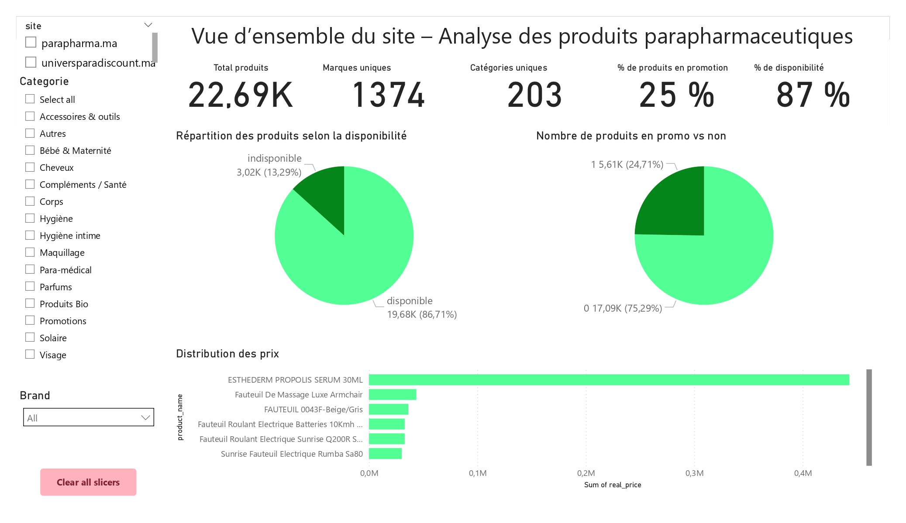
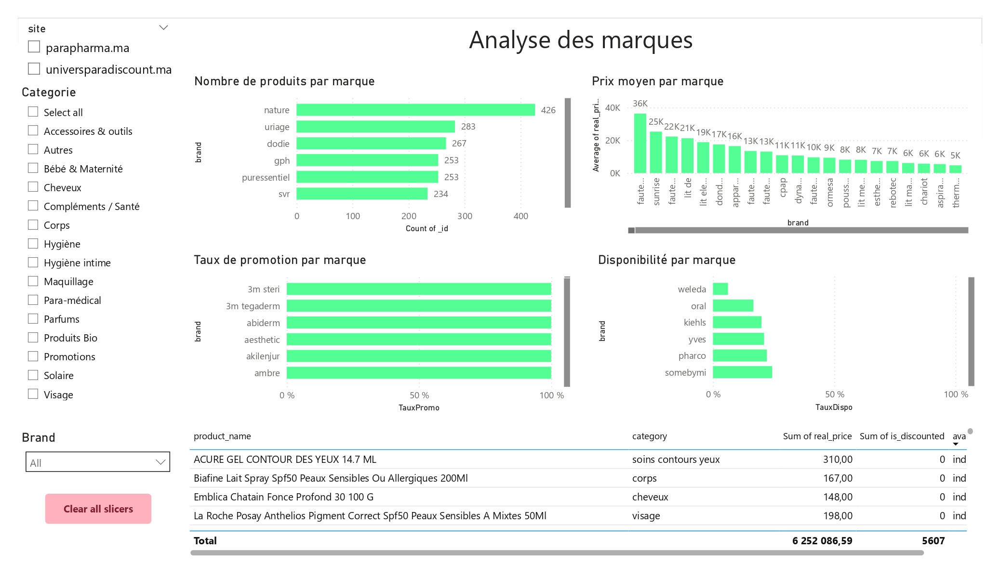
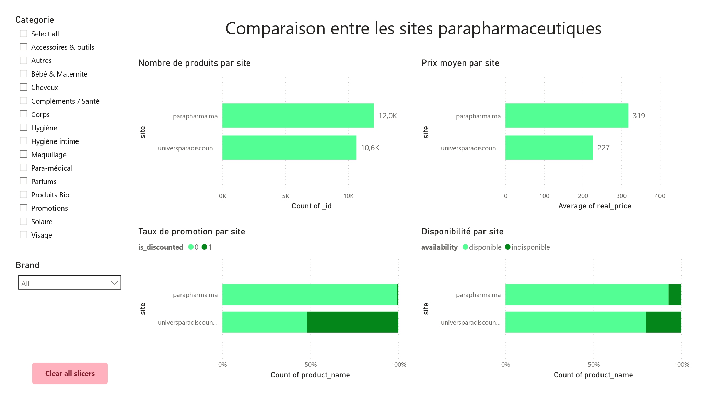
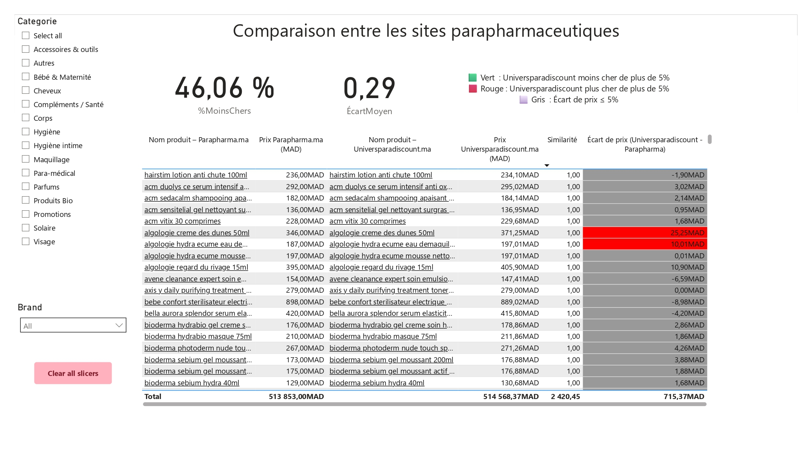

# paraMed Analysis

**paraMed Analysis** is a data-engineering and analytics project for comparing parapharmaceutical products sold on Moroccan e-commerce platforms.
It includes a **Python data pipeline** for scraping and harmonising product data, and an **interactive Power BI dashboard** for visual analysis.

---

## 📌 Project Overview

* **Objective:** Identify, clean, match, and compare products from different websites to analyse price differences and promotions.
* **Data Sources:**

  * [parapharma.ma](https://parapharma.ma)
  * [universparadiscount.ma](https://universparadiscount.ma)
* **Technologies:** Python, MongoDB, Power BI

---

## 🏗 Pipeline Structure

The pipeline automates:

1. **Data Collection** – Web scraping of product information (name, price, brand, size, availability).
2. **Data Cleaning** – Normalisation of product names (`clean_name`), extraction of `brand` and `size`.
3. **Matching** – Detecting equivalent products across platforms (based on brand, size, and similarity scores).
4. **Storage** – Storing results in MongoDB for further analysis.
5. **Visualisation** – Interactive Power BI dashboard for price comparison and KPIs.

---

## 📊 Power BI Dashboard

The dashboard provides:

* **Global KPIs**: Total matched products, % cheaper on each site, average price differences.
* **Slicers**: Filter by brand or category.
* **Graphs**: Price difference distribution, category-wise comparison.
* **Tables**: Detailed product-by-product comparison with clickable links to product pages.

---

### 🖼 Dashboard Snapshots

#### Overview Page



#### Category Analysis



#### Brand Analysis



#### Product-by-Product Comparison



---

## 📂 Repository Structure

```
paraMed_analysis/
│
├── paraMed_pipeline/       # Python pipeline scripts
├── Dashboard/              # Power BI dashboard files & images
├── docs/                   # Documentation & presentation
└── README.md
```

---

## 🚀 How to Use

1. **Run the pipeline** to scrape and clean data:

   ```bash
   python paraMed_pipeline/main.py
   ```
2. **Load results** into Power BI by connecting to the MongoDB database or using exported CSV.
3. **Explore the dashboard** using filters and KPIs.

---

## 📄 Documentation

Detailed methodology and diagrams are available in the PDF inside `/docs`:

> *Presentation Pipeline de Données pour l’Analyse Comparative des Produits Parapharmaceutiques.pdf*

---
